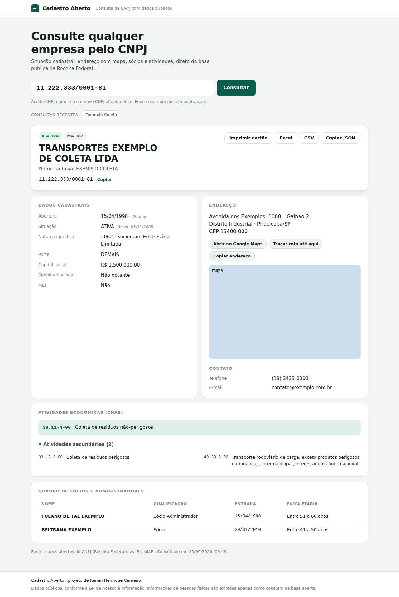
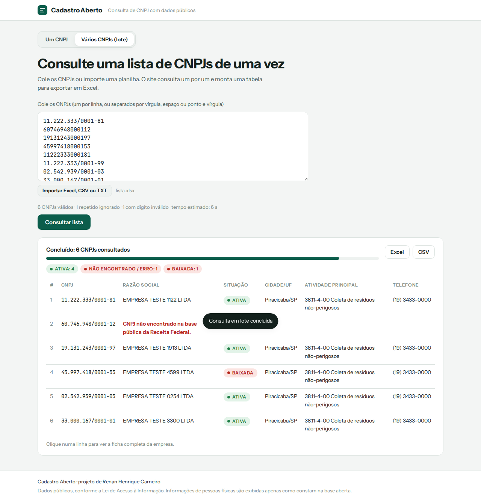

# Cadastro Aberto

Consulta de CNPJ com dados públicos da Receita Federal. Projeto de **Renan Henrique Carneiro**.

**Acesse:** https://rhcarneiro01-source.github.io/cadastro-aberto/





Digite ou cole um CNPJ e veja:

- **Dados cadastrais:** razão social, nome fantasia, situação (com cor: ativa, suspensa/inapta, baixada), matriz ou filial, data de abertura e idade da empresa, natureza jurídica, porte, capital social, Simples e MEI.
- **Endereço com mapa:** botões para abrir no Google Maps, traçar rota até o endereço e copiar o endereço.
- **Contato:** telefones e e-mail.
- **Atividades (CNAE):** a principal e todas as secundárias, com o código formatado.
- **Quadro de sócios e administradores (QSA):** nome, qualificação, data de entrada e faixa etária.
- **Exportação:** Excel com 3 abas (Empresa, CNAEs e Sócios), CSV no padrão do Excel brasileiro (separador `;` e acentos corretos), cartão A4 para imprimir ou salvar em PDF e JSON copiado.
- **Consulta em lote:** cole uma lista de CNPJs ou importe um Excel, CSV ou TXT, e o site consulta todos, um por vez. Mostra o andamento, permite pausar ou cancelar, conta quantas empresas estão ativas, baixadas ou não encontradas, e exporta tudo num Excel com as abas Empresas, Sócios e CNAEs. Clicando numa linha, abre a ficha completa da empresa.
- **Análise do lote:** painel que se atualiza durante a consulta, com indicadores (ativas, empresas que pedem atenção, tempo mediano de empresa e capital social mediano) e gráficos por situação cadastral, tempo de empresa, UF, porte, cidade e atividade principal. Clicando numa barra, a tabela é filtrada por aquela categoria. O Excel do lote ganha a aba **Resumo** com todas essas contagens. Link direto: `…/cadastro-aberto/#lote`.
- **Extras:** histórico das últimas consultas (fica só no navegador), link direto pelo endereço `?cnpj=00000000000000` e validação dos dígitos antes de consultar. O **novo CNPJ alfanumérico** (em vigor desde julho de 2026) também é aceito.

## Como rodar

Não precisa instalar nada. Basta abrir o `index.html` no navegador.

## Como publicar (grátis)

**Opção A: GitHub Pages**, que também serve de portfólio:
1. Crie um repositório público no GitHub, por exemplo `cadastro-aberto`.
2. Envie todos os arquivos desta pasta.
3. Em *Settings › Pages*, escolha *Branch: main*, pasta `/ (root)` e clique em *Save*.
4. Em cerca de 1 minuto o site fica no ar em `https://rhcarneiro01-source.github.io/cadastro-aberto/`.

**Opção B: Netlify Drop**, em 30 segundos: acesse app.netlify.com/drop e arraste esta pasta para a página.

## De onde vêm os dados

A consulta é feita direto do navegador em APIs públicas e gratuitas que redistribuem os **dados abertos do CNPJ** publicados pela Receita Federal:

1. **BrasilAPI** (`brasilapi.com.br/api/cnpj/v1/{cnpj}`): fonte principal.
2. **CNPJ.ws** (`publica.cnpj.ws/cnpj/{cnpj}`): reserva automática quando a primeira falha. Aceita cerca de 3 consultas por minuto.

Os dados podem ter alguns dias de defasagem em relação à Receita. O cartão impresso é informativo e **não substitui** o comprovante oficial emitido pelo site da Receita Federal.

Para acrescentar outra API, inclua um item em `PROVEDORES`, no início de `assets/app.js`, com uma função que converta a resposta para o formato interno (veja `deBrasilAPI` e `deCnpjWs`).

## Estrutura

```
index.html               página
assets/styles.css        visual (tema claro e escuro automático, layout para celular, estilo de impressão)
assets/app.js            validação, consulta, normalização, exibição e exportação
assets/vendor/xlsx...    SheetJS, para gerar o .xlsx sem depender de CDN
```

## Próximos passos possíveis

- Sinais de atenção por empresa (sócios em comum entre fornecedores, empresa recém-aberta, mesmo endereço para várias empresas).
- Distância e tempo de rota a partir de uma base, para roteirização.
- Busca por nome da empresa, que exige outra fonte de dados.

## Licença

MIT © 2026 Renan Henrique Carneiro.
